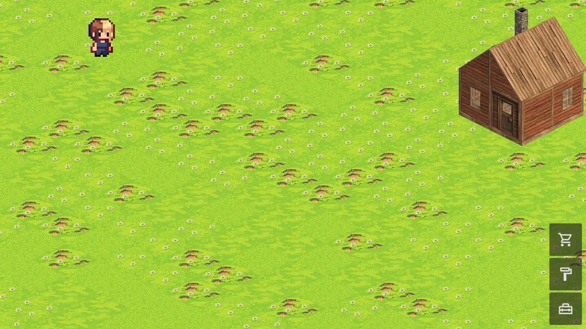
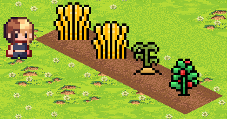
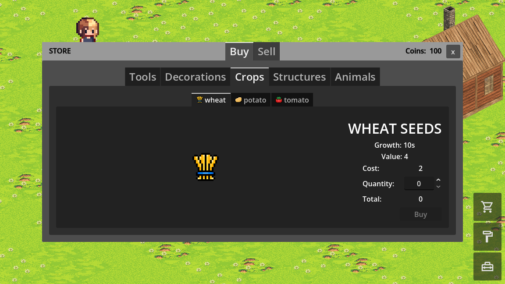
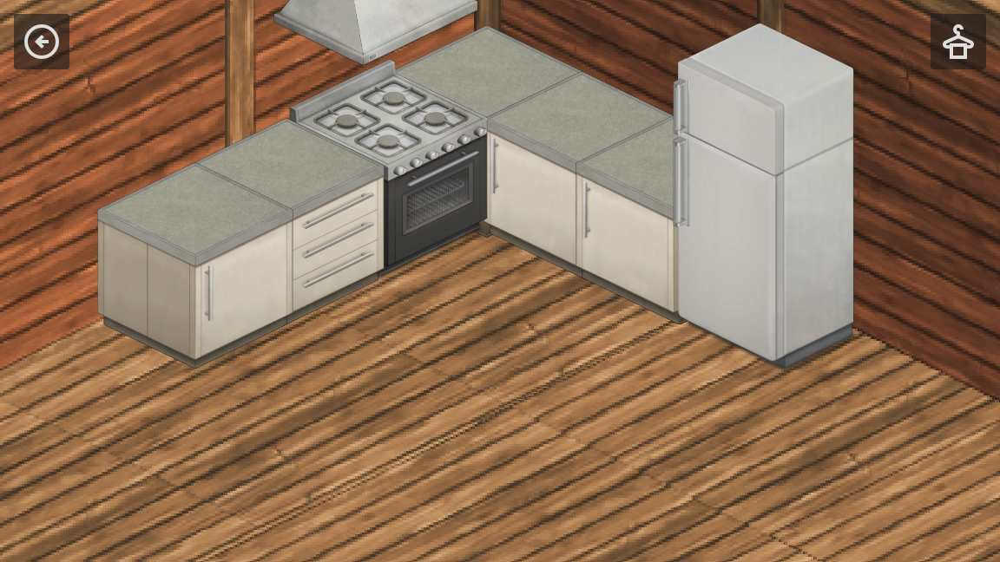

# Farming Game

A cozy farming simulation game made with the Godot Engine.

##  Screenshots

  
  
  
  

##  Gameplay

In this game, you can build your own farm from scratch. Cultivate crops, raise animals, and sell your products to expand your farm.

## Features

*   **Farming:** Plant and harvest a variety of crops like potatoes, tomatoes, and wheat.
*   **Animal Husbandry:** Raise chickens in your own chicken coop and collect eggs.
*   **Customization:** Customize your character's appearance.
*   **Building:** Decorate your farm and home.
*   **Economy:** Buy seeds and other items from the shop, and sell your produce.
*   **Tools:** Use tools like the hoe to work your land.

## How to Play

1.  **Start a New Game:** Begin your journey from the main menu.
2.  **Till the Land:** Use your hoe to prepare the soil for planting.
3.  **Plant Seeds:** Purchase seeds from the shop and plant them in the tilled soil.
4.  **Harvest Crops:** Once your crops are fully grown, harvest them.
5.  **Raise Chickens:** Build a chicken coop and raise chickens to get eggs.
6.  **Sell Produce:** Sell your harvested crops and eggs at the shop to earn money.
7.  **Expand:** Use your earnings to buy more seeds, animals, and decorations to grow your farm.

## Built With

*   [Godot Engine 4.6.2](https://godotengine.org/) - The game engine used.

## Credits

*   Art and audio assets from...
*   [kenney assets](https://www.kenney.nl/assets) 
*   Chicken Sprite Sheet by [PixelPlant](https://pixelplant.itch.io/) 
*   Farm Isometric Assets by [Guilherme Laso](https://guilhermelaso.itch.io/) 
*   egg-static-image by [FlintBear](https://flintbear.itch.io/) 
